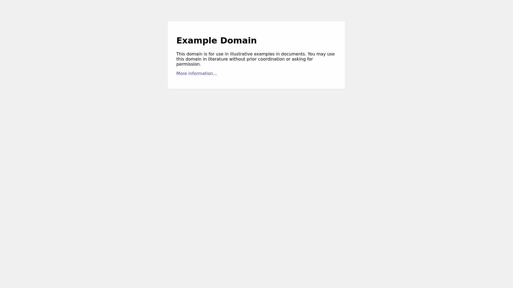
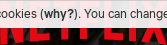

Вебсервис для создания скриншота сайта.

Предоставляет API для создания скриншота:

1. Всего сайта
2. Области сайта

### Установка

1. ```pip install --user pipenv # установка менеджера пакетов```
1. ```pipenv install # установка проекта```
1. ```cp .env_sample .env # создание файла переменных окружения для менеджера пакетов```
1. Задать значения переменных окружения в файле .env 
1. ```pipenv run start```

### Установка в контейнер Docker

1. ```docker build -t web2img .```
1. ```docker run --name web2img -it -p 8899:8899 --mount type=bind,source=/var/www/html/web2img,target=/var/screenshots web2img```

### Как это работает

В Docker крутится контейнер с безголовым Chromium. 

Там же запущен веб-сервер со встроенным pyppeteer.

На веб-сервер можно передать:

1. ID элемента для которого нужно сделать скриншот
1. URL страницы на которой находится этот элемент
1. Дополнительные параметры создания скриншота.

Вебсервер инициализирует pyppeteer, тот в свою очередь подключается
к websocket-порту Chromium, открывает вкладку и через API Chromium
 делает скриншот элемента.

Скриншот сохраняется в специальный каталог.

pyppeteer закрывает вкладку и отключается от Chromium.

Вебсервер отдает информацию о ссылке по которой можно забрать скриншот и
он же раздает скриншоты.

### Пример использования

Сперва нужно запустить Chrome и убедиться, что параметры запуска совпадают с параметрами в файле .env

```google-chrome --headless --disable-gpu --remote-debugging-port=9222```

Браузер может быть запущен и на другом хосте, но этот хост должен быть доступен
по сети для хоста, на котором запущен сервис.

**Скриншот всей страницы**

```http://127.0.0.1:8872/?url=https://example.com/&id=none&nw=1&full_page=1```

1. url - адрес страницы для которой нужно сделать снимок
1. id - идентификатор элемента разметки сайта. В примере указано "none" потому что на данный момент этот
параметр должен быть указан обязательно
1. nw - не дожидаться появления специального элемента, 
указывающего на завершение загрузки страницы (костыль для отрисовки анимации)
1. full_page - сделать снимок всей страницы

**Ответ сервера:**

```JSON
{
  "status": 200,
  "id": "none",
  "result": "/static/web2img_1587108917.229528.png"
}
```

**Изображение**



**Скриншот элемента страницы по его ID**

```http://127.0.0.1:8872/?url=https://www.netflix.com&id=Fill-14&nw=1```

1. url - адрес страницы для которой нужно сделать снимок
1. id - идентификатор элемента разметки сайта.
1. nw - не дожидаться появления специального элемента, 
указывающего на завершение загрузки страницы (костыль для отрисовки анимации)

**Ответ сервера:**

```JSON
{
  "status": 200,
  "id": "Fill-14",
  "result": "/static/web2img_1587109456.357739.png"
}
```

**Изображение**



Как видите, проблемы есть =) 
Можно попробовать встраивать JS на страницу и менять верстку.